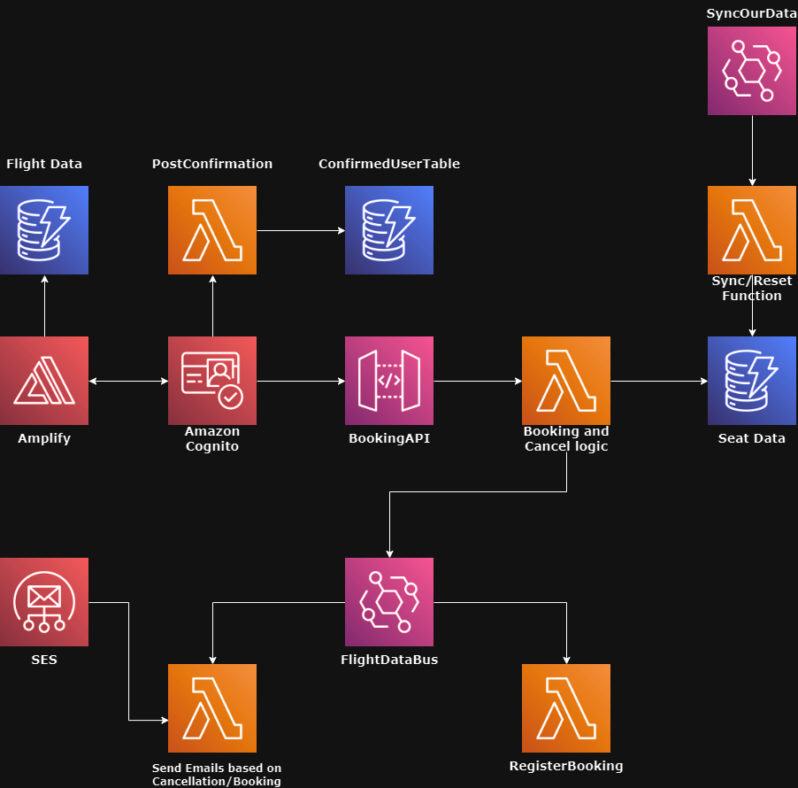

# AWS Flight Booking App 🛫

## Overview 🌐

This Flight Booking App is developed as a way to get my feet wet with AWS CDK, leveraging AWS CDK to build a scalable flight seat booking system. It integrates various AWS services including DynamoDB, Lambda, Cognito, Amplify, API Gateway, EventBridge, and SES.

## Diagram 📐


## Configuration 🛠️

- **Environment Files:** This project uses environment variables to manage configuration settings. Ensure that the `.env` file in the root directory and the `.env.local` file in the `client` directory are properly set up before running the application.
- **Frontend:** The `client` folder contains a Next.js frontend which also utilizes environment variables declared in `.env.local` for proper AWS service integration.

```bash
# backend env file
ENV=dev
USER_POOL_ID=
CLIENT_POOL_ID=
AWS_ACCESS_KEY_ID= 
AWS_SECRET_ACCESS_KEY=
```

```bash
# frontend env file
NEXT_PUBLIC_USER_POOL_ID=
NEXT_PUBLIC_USER_POOL_CLIENT_ID=
NEXT_PUBLIC_AWS_ACCESS_KEY_ID=
NEXT_PUBLIC_AWS_SECRET_ACCESS_KEY=
NEXT_PUBLIC_API_END_POINT=
NEXT_PUBLIC_AWS_REGION=
```

## Features 🌟

- **Real-World Application:** Construct a Flight Seat Booking system using AWS CDK.
- **User Authentication:** 🔐 Manage secure access using AWS Cognito.
- **Flight Booking:** ✈️ Enable users to book and manage flights effectively.
- **Notification System:** 📧 Use AWS SES for timely email notifications.
- **API Development:** Build robust APIs with AWS API Gateway.
- **End-to-End Testing:** Perform comprehensive testing on AWS to ensure application reliability and scalability.

## Prerequisites 📋

- AWS Account
- Node.js
- AWS CLI

## Installation 🔧

1. Clone the repository:
   ```
   git clone https://github.com/hazeliscoding/aws-flight-booking-app
   ```
2. Install dependencies:
   ```
   npm install
   ```
3. Set up your environment variables as outlined in the `.env` and `.env.local` files.
4. Deploy the app using AWS CDK:
   ```
   cdk deploy
   ```

## Usage 📖

Engage with the step-by-step guidance provided in the Udemy course to effectively utilize the integrated AWS services.

## Contributing 🤝

Contributions are welcome! Please consider contributing to further enhance the functionality of this project.

## License 📄

This project is licensed under the MIT License - see the LICENSE file for details.

